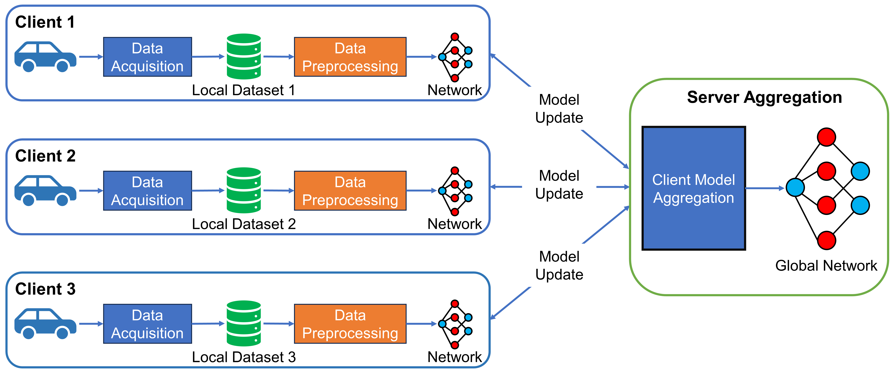

# Federated Learning for Time-Series Data Anomaly Detection in EPS System

This is the offical implementation of the paper: \
**A Federated Learning Approach for Efficient Anomaly Detection in Electric Power Steering Systems (Published)**\
Mr. Kimleang Kea, Professor. Youngsun Han, and Professor. Young-Jae Min

## Introduction

In a traditional learning strategy to detect anomalies in time-series data, the data is collected from the same source and stored in a central server. However, in that case, we need to build up a powerful data center to analyze data from the whole Electrical Power Steering (EPS) system, which turns out to be inefficient. In this project, we propose a Federated Learning (FL) strategy to detect anomalies in time-series data. Because of its characteristics such as model-only exchange and parallel training, the strategy can not only preserve the privacy of data but also reduce the training time. The training simulation is conducted with a distribution of the dataset to different vehicles (FL clients). Each vehicle splits the dataset in a 7:3 ratio. 70% of the dataset is used for training and the rest 30% is used for testing.


*<center>**Figure 1**: Framework of federated learning process for EPS multivariate time series anomaly detection.</center>*

## Summary
- [Federated Learning for Time-Series Data Anomaly Detection in EPS System](#federated-learning-for-time-series-data-anomaly-detection-in-eps-system)
  - [Introduction](#introduction)
  - [Summary](#summary)
  - [Requirements](#requirements)
  - [Preprocessing](#preprocessing)
  - [Model Explanation](#model-explanation)
  - [Training Process](#training-process)
    - [Central ML](#central-ml)
  - [NOTE: Before running the following commands, Please run teh FL\_preprocess.ipynb file to generate the FL dataset.](#note-before-running-the-following-commands-please-run-teh-fl_preprocessipynb-file-to-generate-the-fl-dataset)
    - [Client ML](#client-ml)
    - [FL Model](#fl-model)
  - [Testing Process](#testing-process)
    - [Central ML](#central-ml-1)
    - [Client ML](#client-ml-1)
    - [FL Model](#fl-model-1)
  - [Citation](#citation)
  - [LICENSE](#license)

## Requirements

To install requirements:

```setup
pip install -r requirements.txt
```

## Preprocessing

Preprocess the EPS dataset using the command

```bash
python preprocess.py eps
```

## Model Explanation
- **Central ML**: This model is trained using a centralized learning approach, where all vehicles local data is combined to create a full comprehensive training dataset.
- **Client ML**: This model also utilizes centralized learning approach, where each vehicle local dataset is leveraged for training instead of combination. There is no exchange of model weights during the training process which reduces communication overhead.
- **FL Model**: This model employs FL training that harnesses the power of each vehicle local dataset for training. During the training process, only the local model weights are exchanged between the vehicles and a server.

## Training Process

### Central ML

To train the Central ML model, run this command:

```bash
python preprocess.py eps
python centralized.py --retrain --name USAD_EPS
```
The model will be saved in `checkpoints` directory.

## NOTE: Before running the following commands, Please run teh FL_preprocess.ipynb file to generate the FL dataset.

### Client ML

To train the Client ML model, run this command:

```bash
sh run_clients_training.sh
```

The model will be saved in `checkpoints` directory.

### FL Model

To train the FL model, run this command:

```bash
sh run_fl_training.sh
```

The model will be saved in `checkpoints` directory.

## Testing Process

### Central ML

To test the Central ML model, run this command:

```bash
python preprocess.py eps
python centralized.py --test --name USAD_EPS
```
This will select the pre-trained model in `checkpoints` directory named `USAD_EPS` and test it on the test dataset.

To test each vehicle local data with the Central ML model, run this command:

```bash
sh run_central_testing.sh
```

### Client ML

To test the Client ML model, run this command:

```bash
sh run_clients_testing.sh
```

### FL Model

To test the FL model, run this command:

```bash
sh run_fl_testing.sh
```

## Citation

```
@ARTICLE{kea2024federated,
  author={Kea, Kimleang and Han, Youngsun and Min, Young-Jae},
  journal={IEEE Access}, 
  title={A Federated Learning Approach for Efficient Anomaly Detection in Electric Power Steering Systems}, 
  year={2024},
  volume={12},
  number={},
  pages={67525-67536},
  keywords={Sensors;Anomaly detection;Data models;Sensor systems;Training;Time series analysis;Federated learning;Deep learning;Power steering;Anomaly detection;deep learning;electric power steering (EPS);federated learning},
  doi={10.1109/ACCESS.2024.3397000}
}
```

## LICENSE

[](https://github.com/KimleangSama/flad_in_eps/blob/main/LICENSE)
